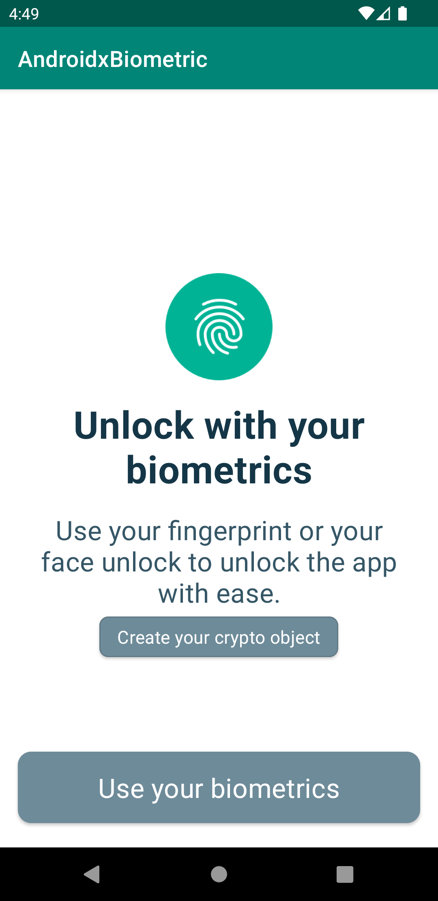

# AndroidXBiometric


AndroidXBiometric is an example of the usage of androidx Biometric API, using a `BiometricPromptUtils.kt` class that wraps up the main methods for building a biometric prompt.

With the launch of Android 10 (API level 29), developers can now use the Biometric API, part of the AndroidX Biometric Library, for all their on-device user authentication needs.
Biometric API provides a standardised dialog that works out of the box across multiple Android versions and persists across orientation changes. Also, it keeps things simple by only requiring you to provide the text that will be displayed to the user and a few callbacks for authentication success or failure.

## Usage

```kotlin
private fun showBiometricPrompt() {
        val biometricPromptUtils = BiometricPromptUtils(this, object : BiometricPromptUtils.BiometricListener {
            override fun onAuthenticationLockoutError() {
                // implement your lockout error UI prompt
            }

            override fun onAuthenticationPermanentLockoutError() {
                // implement your permanent lockout error UI prompt
            }

            override fun onAuthenticationSuccess() {
                // implement your authentication success UI prompt
            }

            override fun onAuthenticationFailed() {
                // implement your authentication failed UI prompt
            }

            override fun onAuthenticationError() {
                // implement your authentication error UI prompt
            }

            override fun onNewBiometricEnrollment() {
                // implement the logic when a new biometric has been enrolled
            }

            override fun onFirstBiometricAuthentication() {
                // implement the logic before a key is generated
            }

        })
        biometricPromptUtils.showBiometricPrompt(
            resources.getString(R.string.confirmYourBiometricsKey),
            resources.getString(R.string.cancelKey),
            confirmationRequired = false
        )
    }
```

If you want to detect when another fingerprint/biometric is added or removed you need to use cipher and secret key to verify biometric data. First, you need to generate a key when the application gives approval to the usage of Biometrics. Usually this happens in the login/sign up flow of the app after entering the Pin, or where you enable the biometrics setting.

```kotlin
 biometricPromptUtils.generateCryptoKey()
```

This key stays valid until biometric data changes by adding a new fingerprint for example. This happens when `setInvalidatedByBiometricEnrollment(true)` is set to true.
If a change gets detected, then the `BiometricPromptUtils.BiometricListener` will post a `onNewBiometricEnrollment()` the first time this happens and then the key would be deleted.
You can enable your biometric setting again in your app, by creating a new key.


## Contributing
Pull requests are welcome. For major changes, please open an issue first to discuss what you would like to change.
